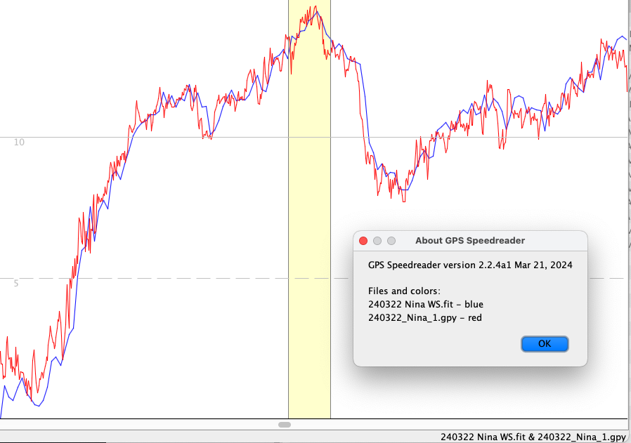

Data are from the second test of the Garmin watch, using "Other" as the activity. The watch data are significantly less filtered
than in the first (SUP-based) test, and speeds are delayed only by about 1-2 seconds. This are wingfoil data. One ESP/u-blox GPS was used for comparison; the ESP
data are quite noisy because the GPS bounced around in a hip bag. Here is a section with the top 10 second run:

