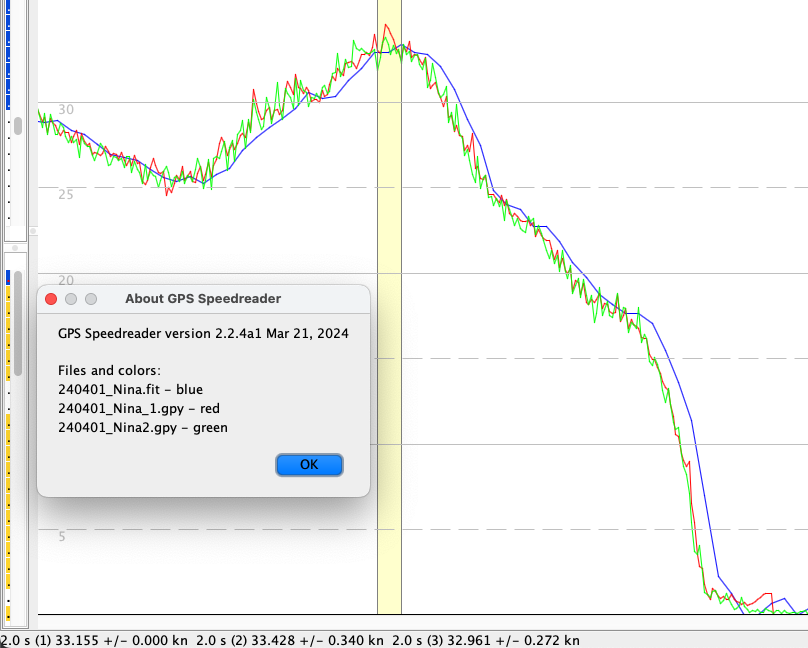

Data from a Garmin 255 watch and two ESP/u-blox loggers.
In this session, the two ESP loggers showed an unusually large difference of about 0.5 knots for the top 2 second result. Here's the run, with the top 2 seconds selected:

